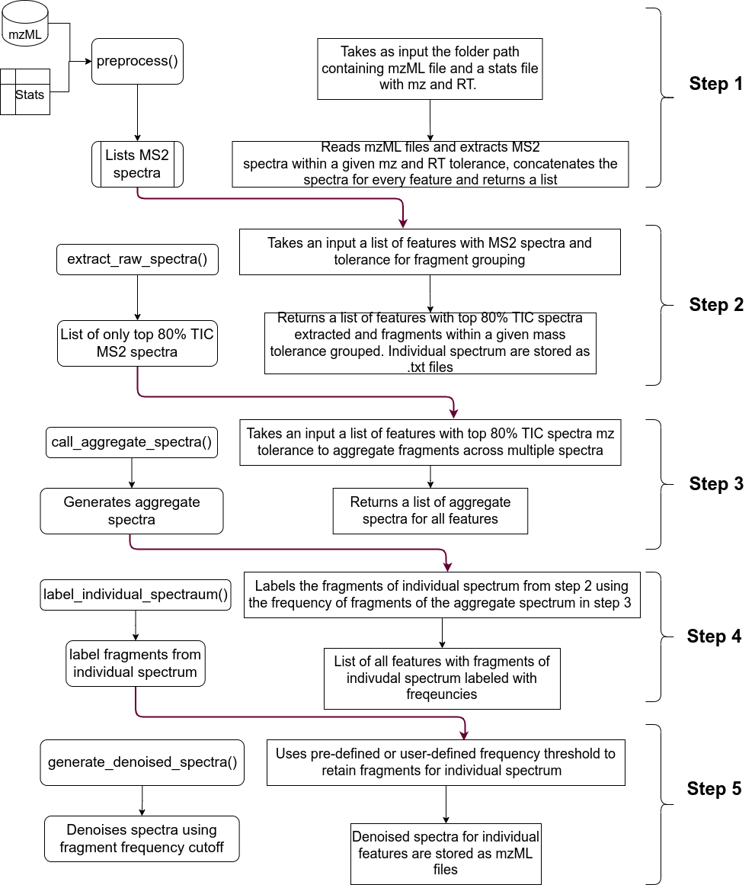

# Denoising Using Replicate Spectra (DuReS)

## Introduction

This package provides a set of easy-to-implement functions to denoise tandem mass spectrometry data. It requires a set of mzML files and a txt file containing feature information (from peak picking) such as the mz and RT as input and outputs a set of mzML files with the same number of features. 

## Installation

First, you need to install two dependencies from Bioconductor: S4Vectors and Spectra
```r
# install.packages("BiocManager")
BiocManager::install(c("Spectra", "S4Vectors"))
```
After this you can proceed with the installation of the development version of the package DuReS as follows:

```r
install.packages("devtools")
devtools::install_github("banerjeeshayantan/dures")
```

## Documentation
Detailed documentation of the package is available [here](https://banerjeeshayantan.github.io/dures/)

## Quick Start
```r
folder_path = "~/metabolomics/test_1/" #folder path containing mzml/ and Stats.txt in required format
l1 = preprocess(folder_path = folder_path, ppm = 5, tol_rt = 0.1) #reads mzml files, prepares Stats file, extracts spectra and concatenates spectra
l2 = extract_raw_spectra(folder_path = folder_path, l1, 0.05, 0.8) #extract top x% (where x = 0.8) TIC spectra, groups fragments within a given tolerance (0.05 Da)
l3 = call_aggregate(l2$sps_top_tic_2, 0.05, folder_path) #aggregates multiple spectra for a given feature by grouping fragments within a given tolerance and also generates frequency of those fragments
l4 = label_individual_spectrum(l3, folder_path, 0.05) #using the fragment frequencies of the aggregate learnt from teh previous step, it labels the individual spectrum for a given feature
l5 = generate_denoised_spectra(l4, folder_path, ion_mode = "pos") #using a cutoff denoises individual spectrum for every feature and stores it as an mzML file in folder_path
```

## Package Workflow


## Citation
Please cite the following paper if you use our package

