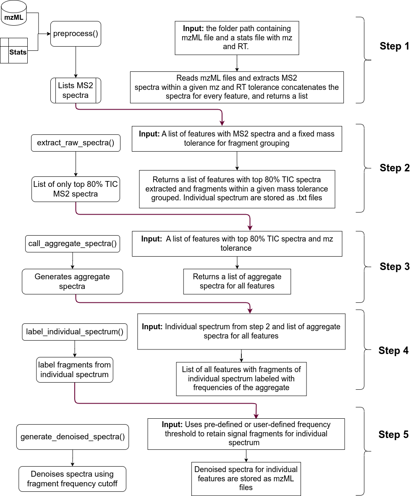

# Denoising Using Replicate Spectra (DuReS)

## Introduction

This package provides a set of easy-to-implement functions to denoise tandem mass spectrometry data. It requires a set of mzML files and a txt file containing feature information (from peak picking) such as the mz and RT as input and outputs a set of mzML files with the same number of features. 

## Installation

First, you need to install two dependencies from Bioconductor: S4Vectors and Spectra
```r
# install.packages("BiocManager")
BiocManager::install(c("Spectra", "S4Vectors"))
```
After this you can proceed with the installation of the development version of the package DuReS as follows:

```r
# install.packages("devtools")
devtools::install_github("banerjeeshayantan/dures")
```

## Documentation
Detailed documentation of the package is available [here](https://banerjeeshayantan.github.io/dures/)

## Package Workflow


## Citation
Please cite the following paper if you use our package

